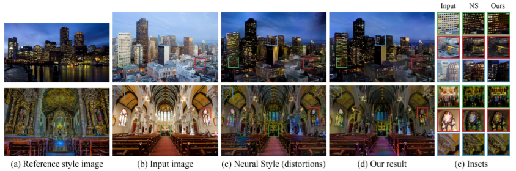
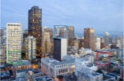
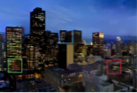
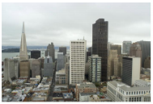
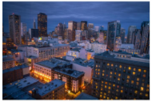
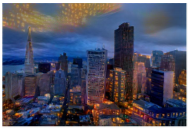
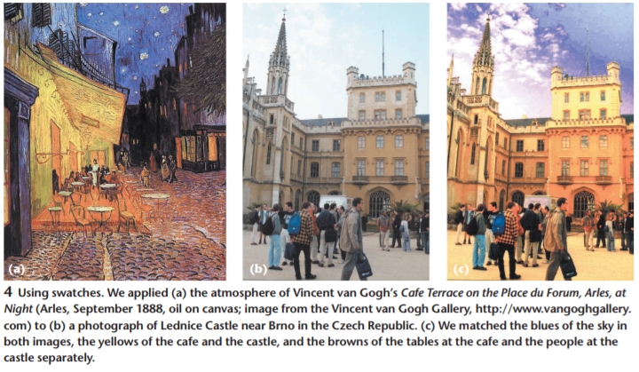
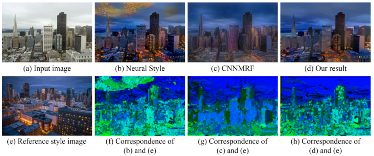

# Deep Photo Style Transfer

&nbsp;

> 그림1: (a) 이미지와 (b) 이미지 를 넣어서 새로운 이미지를 만든다. (b) 그림에 (a) 스타일을 가지는 이미지를 output으로 만든다. (여기서, (c)는 Neural Style을 이용하여 만든 이미지이고 (d)는 이 논문에서 만든 알고리즘이 만든 이미지이다.) **(c)** 는 색깔을 잘 변환시킨 것 처럼 보여진다. 하지만, 페인팅한 것 같은 왜곡이 생겼다. 그에 반해, **(d)** 는 색깔을 잘 변환시켰을 뿐만 아니라, photorealism(사진이 얼마나 사실적으로 표현하는지)도 유지시켰다.
**(e)** 를 확대하여 두 알고리즘의 결과를 비교해보라.

&nbsp;

## Abstract

이 논문은 참조 스타일을 잘 반영하면서 다양한 이미지 컨텐츠를 처리하는 사진 스타일 변형에 대한 딥러닝 방법을 소개한다.

우리의 방법은 신경망의 여러 레이어를 고려하여 이미지의 정보와 스타일을 구분하는 회화 적 변형에 대한 최근 작업을 토대로한다.

그러나, 이 방법은 사실적인 스타일 변환에 적합하지 않다.

입력이미지와 참조이미지가 모두 사진인 경우에도 왜곡때문에 출력은 여전히 그림을 연상시킨다.

우리의 공헌은 입력에서 출력으로의 변환을 색상 공간의 로컬 affine으로 제한하고 이러한 제약을 완전히 차별화 가능한 energy term으로 표현하는 것이다.

이 방법을 사용하면 시간, 날씨, 계절 및 예술적으로 변형시키는 등 다양한 시나리오에서도 왜곡 및 yield을 방지하여 실제 사진처럼 보이도록 할 수 있다.

&nbsp;

## 1. Introduction

사진 스타일 변형은 참조 스타일 사진의 스타일을 다른 입력 사진으로 전환하려는 오랜 문제이다.

예를 들어, 참조 스타일 사진을 적절하게 선택함으로써, 입력 사진을 다른 조명, 시간 또는 날씨에서 촬영 한 것처럼 보이게 할 수 있고, 다른 의도로 인공적으로 수정한 것처럼 보이게 할 수도 있다.

지금까지의 기존 기술들은 장면의 다양성이나 그들이 원하는 방향으로 사진을 변경하는데 있어서는 한계가 있다.

이 논문에서는 스타일을 바꾸면서도 왜곡없는 결과를 만드는 딥러닝 방법을 소개한다.

우리의 방법은 Gatys et al의 [Neural Style transfer](https://www.semanticscholar.org/paper/Image-Style-Transfer-Using-Convolutional-Neural-Gatys-Ecker/7568d13a82f7afa4be79f09c295940e48ec6db89?tab=abstract)에 토대를 두고 있다.

그러나 **그림1** 에서 보았듯이, 입력이미지와 참조이미지가 사진이라도 결과는 여전히 그림처럼 보인다. 예를들어 직선 모서리가 곡선처럼 보인다거나 규칙적인 질감이 불규칙적으로 보인다.

우리는 이 **공간 왜곡을 방지하고 색상 부분만 변형** 하여 더 이상 그림처럼 보이지 않도록 하였다.

우리는 [Matting Laplacian](http://webee.technion.ac.il/people/anat.levin/papers/Matting-Levin-Lischinski-Weiss-CVPR06.pdf) 에서 영감을 얻어, 색상 공간에서 지역적으로 affine 을 갖는 변환 모델로 구현한다.

이 방법은 변형 faithfulness에 미치는 영향을 최소화함으로써 왜곡을 방지한다.

&nbsp;

입력 이미지와 참조 이미지 사이의 컨텐츠의 차이로 인하여 바람직하지 않은 결과를 초래하는 문제도 우리는 해결한다.

예를 들어, 하늘이 조금 보이는 입력 이미지가 있다고 하자. 참조 이미지와 입력 이미지 사이의 컨텍스트의 차이를 무시하여 변환한다면 하늘 스타일을 과하게 적용시킬 수 있다.

우리는 이 문제를 입력 및 참조 이미지의 [semantic segmentation](https://arxiv.org/pdf/1606.00915.pdf)을 사용하여 해결한다.

시간, 날씨, 계절 및 예술적 편집적인 변형을 포함하여 다양한 시나리오에 대해 스타일을 진짜처럼 변경을 해주는 우리의 방법이 효과적임을 보여줄게.

&nbsp;

### 1.1 Challenges and Contributions

실용적인 관점에서 우리의 알고리즘은 효과적이다.

입력사진의 시간대를 바꾸거나 날씨를 바꾸거나 예술적으로 수정하는 등 많은 응용 분야에 쓰일 수 있다.

이러한 결과를 얻기 위해서 **두 가지 근본적인 문제** 를 해결해야 했다.

&nbsp;

#### 문제점 1. 공간적인 왜곡

우리의 목표에는 본질적으로 주의해야할 점이 있다.

| Input Image     | Output Image     |
| :------------- | :------------- |
|        |        |

먼저, 위 사진에서 빌딩의 창문들은 매우 밝아지는 것을 목표로 한다.

하지만 이러한 효과를 줄 때 창문의 그리드 상에 정렬 된 채로 있도록 하는 모서리 및 규칙적인 패턴을 왜곡해서는 안된다.

이미지 색상은 바꾸면서, 공간 왜곡은 없는 변형을 찾는다.

[pager - Color Transfer
between Images](https://www.cs.tau.ac.il/~turkel/imagepapers/ColorTransfer.pdf) 에서는 전체적인 색상 변환으로 이 문제를 해결했다.

그러나, 이러한 변환은 부분적으로 변화하는 것을 표현할 수 없기 때문에 원하는 스타일을 적용하기에는 제한적이다.

표현을 더 많이 하려고 할수록 공간적으로 다양한 효과가 더 필요해지면서 그에 따른 공간 왜곡 또한 커진다.

[Transient
attributes for high-level understanding and editing of outdoor
scenes](), [Data-driven
hallucination of different times of day from a single outdoor
photo]()

위 두 연구에서는 특정 시나리오에 대한 몇 가지 기술은 존재하지만, 일반적인 경우에는 역시 제한적이다.

우리의 작업은 위 문제를 해결하는 솔루션을 제공한다.

&nbsp;

#### 문제점 2. Semantic accuracy and transfer faithfulness

| Input Image     | Reference Image     | Output(Neural Style)|
| :------------- | :------------- | :-----|
|   | ||

&nbsp;

실세계의 복잡성은 또 다른 문제를 야기한다.

사진에서 각 장면의 의미를 반영해야 한다.

예를 들어, 도시 사진에서는 건물의 모양이 건물과 일치해야 하고 하늘은 하늘과 일치해야 한다.

하늘을 건물처럼 표현하는 것은 용납되지 않는다.

&nbsp;

그럴듯한 해결책 중 하나는 각 입력 신경 패치를 참조이미지에서 가장 유사한 패치와 일치시켜 택도 없는 변환을 줄이는 것이다.

이 방법은 [CNNMRF 방법](https://www.cv-foundation.org/openaccess/content_cvpr_2016/papers/Li_Combining_Markov_Random_CVPR_2016_paper.pdf)에서 채택 된 전략이다.

입력 patch들이 스타일 patch와 쌍을 이루는 경우가 대부분이지만, 스타일 이미지의 전체 영역이 무시되어 원하는 스타일과 다른 결과가 나오는 경우가 종종 있다.

이 문제에 대한 한 가지 해결책은 신경 반응의 [Gram matirix](https://www.cv-foundation.org/openaccess/content_cvpr_2016/papers/Gatys_Image_Style_Transfer_CVPR_2016_paper.pdf)에 의해 캡쳐된 참조 이미지의 완전한 "스타일 분포"를 변형하는 것이다

이 방법은 모든 지역이 무시되는 것을 방지한다.

그러나 입력 이미지에는 참조 이미지보다 더 많은 (또는 적은) 장면 요소가 있을 수 있다.

이 경우에 참조 이미지의 큰 요소 스타일이 입력 이미지의 불일치한 요소에 "spills over" 되어 하늘에서 건물모양이 생성될 수 있다.

&nbsp;

우리는 변형 과정에 입력 및 스타일 이미지의 semactic 라벨링을 통합하여

의미적으로 동등한 하위 영역 사이에서 변형이 이루어 지도록 하며

각 영역 내에서 매핑이 거의 균일하게 이루어 지도록 하였다.

&nbsp;

앞으로 살펴보겠지만, 이 알고리즘은 원하는 스타일의 풍부함을 보존하고 "spills over" 를 방지한다.

&nbsp;
&nbsp;

### 1.2 Related Work (기존의 연구들)

글로벌 스타일 변형 알고리즘은 공간적인 특징을 무시하고 전체적으로 이미지를 처리한다.

이러한 방법은 효과적이고 전역 색상 변경 및 톤 곡선 (예를들어, 높음 또는 낮음 대비)과 같은 간단한 스타일을 처리 할 수 ​​있다.

~~(휴대폰 필터, 포토샵에서 색보정, 밝기보정 등을 말하는 것 같음)~~

예를 들어, [Reinhard et al.의 논문](https://www.cs.tau.ac.il/~turkel/imagepapers/ColorTransfer.pdf)에서는 입력과 참조 스타일 이미지를 비 상관 색 공간으로 변환 한 후에 평균과 표준 편차를 매칭한다.

[피티 (Pitié) et al. 의 논문](http://citeseerx.ist.psu.edu/viewdoc/download?doi=10.1.1.524.6154&rep=rep1&type=pdf) 은 일련의 1D 히스토그램을 사용하여 전체 3D 색 막대 그래프를 전송하는 알고리즘을 설명한다.

결과 섹션을 보면 알겠지만, 정교한 스타일에는 제한적인 방법이다.

(TODO. 번역)
... 그외 많은 방법들 소개

그러나 특정 시나리오에 전념하는 이러한 기술과 달리

우리의 방법은 보다 일반적이며 다양한 스타일을 자연스럽게 만들 수 ​​있다.

&nbsp;

> 그림 2 : 입력 이미지 (a)와 참조 스타일 이미지 (e)가 주어지면, <u>(b) Gatys et al. 의 (Neural Style)</u> 및 <u>(c) Li et al. 의 (CNNMRF)</u> 는 <u>(d)우리의 결과</u> 와 비교해보면 왜곡 때문에 인공적인 부분이 존재한다. (f, g, h)에서는 우리는 출력이미지와 참조이미지의 대응(correspondence)을 계산한 것이다. 각 픽셀에 대해 참조이미지의 가장 가까운 patch의 XY 좌표를 (R, G, B ) = (0, 255 × Y / 높이, 255 × X / 너비)로 인코딩 한 결과이다. 가장 가까운 신경 patch는  VGG-19 conv3_1 층의 신경 반응에 대한 L2 표준을 사용하여 발견된다. CNNMRF 처럼...
 **(b)** 는 (f)에 나타난 바와 같이 텍스처 스타일 불일치를 발생시키는 경향이 있는 참조이미지의 글로벌 통계를 계산한다. 예를 들어, 출력 이미지의 하늘 부분은 참조 스타일 이미지에서 건물로 매핑된다.
 **(c)** 는 (g)에서 보여지는 것처럼 many-to-one 매핑을 갖는 경향이 있는 참조이미지의 가장 가까운 이웃 검색을 계산한다 (예 : 건물 참조).
 **(d)** 는 (b),(c)보다 왜곡을 방지하고 (h)에 표시된대로 텍스처를 정확하게 일치시킨다.

 &nbsp;
 &nbsp;

## 2. Method

## 3. Implementation Details

## 4. Results and Comparison

## 5. Conclusions

## Acknowledgmentts

## References
