# Deep Photo Style Transfer

&nbsp;

## Abstract

**본 논문은 `입력 이미지`를 `참조 이미지`의 스타일로 바꿔주는 딥러닝 방법을 소개한다.**

우리의 방법은 신경망의 여러 레이어를 고려하여 최근 연구인 이미지의 content에서 style을 구분하여 변형시키는 방법을 토대로 한다.

그러나, 이는 `photorealistic style transfer`에 적합한 방법이 아니다.

심지어 `입력 이미지`와 `참조 이미지`가 모두 사진인 경우에도 왜곡으로 인하여 출력 이미지는 그림처럼 보이는 경우도 있다.

우리의 공헌은 결과로 변환을 색상 공간의 로컬 affine으로 제한하고 이러한 제약을 완전히 차별화 가능한 energy term으로 표현한 것이다.

이를 이용하여 여러가지 경우에서 시간, 날씨, 계절을 바꿀 수 있고 예술적으로 변경도 가능하며, 이는 왜곡 및 yield을 방지하기 때문에 실제 사진처럼 보인다.

&nbsp;

## 1. Introduction

`photo style transfer` 은 참조 이미지의 스타일을 다른 입력 이미지로 변환시키기 위한 오랜 문제이다.

예를 들어, 참조 이미지를 적절하게 선택함으로써, 입력 이미지를 다른 조명, 시간 또는 날씨에서 촬영 한 것처럼 보이게 할 수 있고, 한편으로는 인공적으로 수정한 것처럼 보이게 할 수도 있다.

지금까지의 연구들은 장면의 다양성이나 그들이 원하는 방향으로 이미지를 변형하는데 있어서는 한계가 있었다.

**본 논문에서는 스타일을 바꾸면서도 왜곡없는 결과를 만드는 딥러닝 방법을 소개한다.**

우리의 방법은 Gatys et al의 [Neural Style transfer](https://www.semanticscholar.org/paper/Image-Style-Transfer-Using-Convolutional-Neural-Gatys-Ecker/7568d13a82f7afa4be79f09c295940e48ec6db89?tab=abstract)에 토대를 두고 있다.

그러나 `그림1`의 (c)를 보면 입력 이미지와 참조 이미지가 사진이라도 결과는 여전히 그림처럼 보인다. 예를들어 직선 모서리가 곡선처럼 보인다거나 규칙적인 질감이 불규칙적으로 보인다.

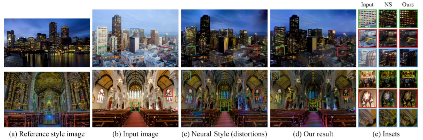

> 그림1: (a) 이미지와 (b) 이미지로 새로운 이미지를 만든다.   (b) 그림에 (a) 스타일을 가지는 이미지를 만드는 것이다.  
**(c)** 는 색깔을 잘 변환시킨 것 처럼 보여진다. 하지만, 페인팅한 것 같은 왜곡이 생겼다.  
**(d)** 는 색깔을 잘 변환시켰을 뿐만 아니라, photorealism(사진이 얼마나 사실적으로 표현하는지)도 유지시켰다.  
**(e)** 를 확대하여 두 알고리즘의 결과를 비교해보라.

&nbsp;

우리는 이 **공간은 왜곡시키지 않으면서 색상 부분만 변형** 하여 실제 사진처럼 보이도록 하였다.

**우리는 [Matting Laplacian](http://webee.technion.ac.il/people/anat.levin/papers/Matting-Levin-Lischinski-Weiss-CVPR06.pdf) 에서 영감을 얻어, 색상 공간에서 지역적으로 affine 을 갖는 변환 모델로 구현하였다.**

변형 faithfulness에 미치는 영향을 최소화함으로써 왜곡을 방지한 것이다.

&nbsp;

입력 이미지와 참조 이미지 사이의 content 차이로 인하여 이상한 결과를 만드는 것도 우리는 해결한다.

예를 들어, 하늘이 조금 보이는 입력 이미지가 있다고 하자. 참조 이미지와 입력 이미지 사이의 컨텍스트의 차이를 무시하여 변환한다면 하늘 스타일을 과하게 적용시킨 결과가 나올 수 있다.

우리는 이 문제를 입력 및 참조 이미지의 [semantic segmentation](https://arxiv.org/pdf/1606.00915.pdf)을 사용하여 해결한다.

시간, 날씨, 계절 및 예술적으로 수정하는 등의 여러가지 경우에서 진짜 사진처럼 변형시키는 우리의 방법이 효과적임을 보여주겠다.

&nbsp;

### 1.1 Challenges and Contributions

우리의 알고리즘은 매우 실용적이다.

입력사진의 시간대를 바꿀 수 있고 날씨도 바꿀 수 있으며, 예술적으로 수정할수도 있는 등 많은 응용 분야에 쓰일 수 있다.

이러한 결과를 얻기 위해서 **두 가지 근본적인 문제** 를 해결했다. (`Neural Style Transfer` 는 아래 두가지 문제를 가짐)

&nbsp;

#### 문제점 1. 공간이 왜곡된다

| Input Image     | Output Image     |
| :------------- | :------------- |
| 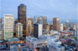       | 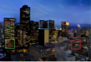       |

&nbsp;

우리의 과제에는 본질적으로 주의해야 할 것이 있다.

먼저, 위 빌딩의 창문들을 밝아지게끔 한다.

하지만 이러한 효과를 줄 때 창문의 모양을 변경시켜서는 안된다. 모서리 및 규칙적인 패턴을 왜곡해서도 안된다.

**이미지 색상은 변형하지만, 공간적인 왜곡은 없어야 한다.**

&nbsp;

**해결 시도 1.**

[pager - Color Transfer
between Images](https://www.cs.tau.ac.il/~turkel/imagepapers/ColorTransfer.pdf) 에서는 전체적인 색상 변환으로 이 문제를 해결했다.

그러나 여기서는 공간을 부분적으로 변환시킬 수 없기 때문에, 원하는 스타일을 적용하기에는 제한적이다.

다양한 스타일을 적용할수록 공간적인 왜곡 또한 커진다.

&nbsp;

**해결 시도 2.**

[Transient
attributes for high-level understanding and editing of outdoor
scenes](), [Data-driven
hallucination of different times of day from a single outdoor
photo]()

위 두 연구에서는 특정 시나리오에 한해서 몇 가지 해결책이 존재한다.

하지만, 일반적인 경우에는 역시 부적절하다.

&nbsp;

본 논문은 위 문제를 해결하는 솔루션을 제공한다.

&nbsp;

#### 문제점 2. 의미에 맞게 변형하지 못함

| Input Image     | Reference Image     | Output(Neural Style)|
| :------------- | :------------- | :-----|
| 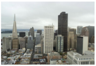  | 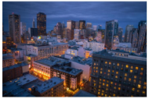|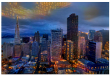|

&nbsp;

사진의 복잡한 구조가 또 다른 문제를 야기시킨다.

이미지는 각 장면의 의미를 충실히 표현해야 한다.

예를 들어, 위 사진의 건물은 건물 다워야 하고 하늘은 하늘 다워야 한다.

제일 오른쪽 사진처럼 하늘을 건물처럼 표현해서는 안된다.

&nbsp;

그럴듯한 해결책 중 하나는 각 입력 신경 패치를 참조이미지에서 가장 유사한 패치와 일치시켜 택도 없는 변환을 줄이는 것이다.

이 방법은 [CNNMRF 방법](https://www.cv-foundation.org/openaccess/content_cvpr_2016/papers/Li_Combining_Markov_Random_CVPR_2016_paper.pdf)에서 사용되었다.

대부분의 입력 patch들이 스타일 patch와 쌍이루지만, 스타일 이미지의 전체 영역이 무시되어 원하는 스타일과 다른 결과가 종종 발생한다.

이 문제에 대한 한 가지 해결책은 신경 반응의 [Gram matirix](https://www.cv-foundation.org/openaccess/content_cvpr_2016/papers/Gatys_Image_Style_Transfer_CVPR_2016_paper.pdf)에 의해 캡쳐된 참조 이미지의 완전한 "스타일 분포"를 변형하는 것이다

이 방법은 모든 지역이 무시되는 것은 막아주겠지만, 만약 입력 이미지가 참조 이미지보다 더 많은 (또는 적은) 장면 요소가 있다면 하늘에서 건물모양이 생성된 것처럼 `spills over` 될 수가 있다.

&nbsp;

우리는 변형 과정에 입력 및 참조 이미지의 semactic 라벨링을 수행하여

의미적으로 동등한 하위 영역 사이에서 변형이 이루어 지도록 하여 (호수,강,바다,물 등을 동일취급함 )

각 영역 내에서 매핑이 거의 균일하게 이루어 지도록 하였다.

&nbsp;

앞으로 살펴보겠지만, 이 알고리즘은 원하는 스타일의 다양함은 유지하면서 `spills over` 는 방지한다.

&nbsp;
&nbsp;

### 1.2 Related Work (기존의 연구들)

글로벌 스타일 변형 알고리즘은 공간적인 특징을 무시하고 전체적으로 이미지를 처리한다.

이러한 방법은 효과적이고 전역 색상 변경 및 톤 곡선 (예를들어, 높음 또는 낮음 대비)과 같은 간단한 스타일을 처리 할 수 ​​있다.

~~(휴대폰의 필터, 포토샵의 색보정, 밝기보정 등을 말하는 것 같음)~~

예를 들어, [Reinhard et al.의 논문](https://www.cs.tau.ac.il/~turkel/imagepapers/ColorTransfer.pdf)에서는 입력과 참조 이미지를 비 상관 색 공간으로 변환 한 후에 평균과 표준 편차를 매칭한다.

[피티 (Pitié) et al. 의 논문](http://citeseerx.ist.psu.edu/viewdoc/download?doi=10.1.1.524.6154&rep=rep1&type=pdf) 은 일련의 1D 히스토그램을 사용하여 전체 3D 색 막대 그래프를 전송하는 알고리즘을 설명한다.

결과 섹션을 보면 알겠지만, 정교한 스타일에는 제한적인 방법이다.

(TODO. 번역)
#### ... 그외 많은 방법들 소개 생략함!

&nbsp;

그러나 특정 시나리오에 전념하는 이러한 기술과 달리

우리의 방법은 보다 일반적이며 다양한 스타일을 자연스럽게 만들 수 ​​있다.

&nbsp;

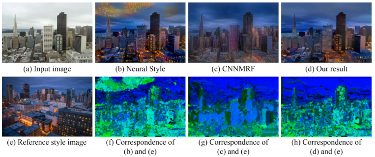

> 그림 2 : 입력 이미지 (a)와 참조 이미지 (e)가 주어지면, <u>(b) Gatys et al. 의 (Neural Style)</u> 및 <u>(c) Li et al. 의 (CNNMRF)</u> 는 <u>(d)우리의 결과</u> 와 비교해보면 왜곡 때문에 인공적인 부분이 존재한다. (f, g, h)에서는 우리는 출력이미지와 참조이미지의 대응(correspondence)을 계산한 것이다. 각 픽셀에 대해 참조이미지의 가장 가까운 patch의 XY 좌표를 (R, G, B ) = (0, 255 × Y / 높이, 255 × X / 너비)로 인코딩 한 결과이다. 가장 가까운 신경 patch는  VGG-19 conv3_1 층의 신경 반응에 대한 L2 표준을 사용하여 발견된다. CNNMRF 처럼...
 **(b)** 는 (f)에 나타난 바와 같이 텍스처 스타일 불일치를 발생시키는 경향이 있는 참조이미지의 글로벌 통계를 계산한다. 예를 들어, 출력 이미지의 하늘 부분은 참조 이미지에서 건물로 매핑된다.
 **(c)** 는 (g)에서 보여지는 것처럼 many-to-one 매핑을 갖는 경향이 있는 참조이미지의 가장 가까운 이웃 검색을 계산한다 (예 : 건물 참조).
 **(d)** 는 (b),(c)보다 왜곡을 방지하고 (h)에 표시된대로 텍스처를 정확하게 일치시킨다.

 &nbsp;
 &nbsp;

## 2. Method

우리 알고리즘은 두 가지 이미지를 사용한다.

입력 이미지 : 일반 사진
참조 이미지 : 스타일을 표현할 참조 이미지

우리는 결과 이미지가 스타일을 변형하면서도, 실제 사진인 것처럼 보이기를 원한다.

**두 가지 핵심 아이디어를 도입하여 `Neural Style Algorithm`을 보완한다.**

&nbsp;

- Idea 1. 우리는 왜곡을 방지하기 위해서 입력 이미지의 지역적인 affine 색상 변환에 의해 재구성된 이미지를 제한하도록 최적화 중에 목적 함수에서 **photorealism regularization term**을 제안한다.

&nbsp;

- Idea2. 우리는 물체가 달라지는 문제를 피하기 위해 입력이미지의 **semantic segmentation** ([2]와 유사)에 기반한 스타일 변환에 대한 가이드를 소개한다. (이 프로세스는 결과이미지의 photorealism을 크게 향상시킴)

&nbsp;

### 배경지식

완벽을 위해 `Gatys et al.의 Neural Style Algorithm`을 잠깐 살펴보도록 하자.

`O(Output Image)` 를 생산하기 위해서 `S(Reference Style Image)` 를 `I(Input Image)` 에 이전시킨다. (objective function을 최소화 함으로써)

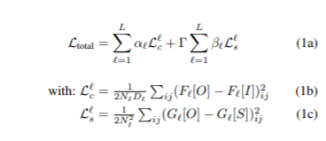

`L` : Convolution layer의 총 수

`l` : dCNNs의 l번째 Convolution layer

`Gram matrix G\` [·] = F\` [F] [N] T ∈ RN\` × N\`` : 벡터화 된 피쳐 맵 간의 내부 제품으로 정의된다.

`α\`, β\`` : 레이어 기본 설정을 구성하기위한 가중치

`Γ` : content (Eq. 1b)와 스타일 (Eq. 1c) 간의 균형을 조정하는 가중치

각 계층에는 Nl 개의 필터가 있으며, 각 필터는 크기가 Dl 인 벡터화 된 feature matrix가 있다.

`F [·] ∈ RN\` × D\` ` : 인덱스를 나타내는 (i, j)의 feature matrix

``

&nbsp;

### Photorealism regularization

**여기서는 입력 이미지의 구조는 유지시키고 사실적으로 출력을 생성하기 위해 어떻게 최적화 스키마를 정규화 하는지를 설명하겠다.**

우리의 전략은 이 제약을 출력 이미지에 적용시키는 것이 아니라 입력 이미지가 변환된 것 대해 나타내는 것이다.

사실적 이미지의 공간을 특성화하는 것은 해결되지 않은 문제이다.

우리의 직관은 그 문제를 해결하지 않아도 된다는 것을 알고 있다. 입력이 이미 사진이기 때문이다.

우리는 이미지 왜곡에 불이익을 주는 용어를 (Eq. 1a) 에 추가하여 전송하는 동안 이 속성을 잃지 않도록 할 것이다.

**우리의 해결책은 색상 공간에서 로컬로 affine 인 이미지 변환을 찾는 것이다.**

즉, 각 출력 patch에 대해 입력 RGB 값을 출력 상대에 매핑하는 affine 함수가 있는 함수를 찾는 것이다.

각 patch는 서로 다른 affine function을 가질 수 있으며, 공간 변화를 허용한다.

에지 patch를 고려해볼 수 있다.

RGB 채널의 affine 조합 세트는 광범위한 변형 세트에 걸쳐 있지만 에지 자체는 모든 채널의 동일한 위치에 있기 때문에 이동할 수 없다.

공식적으로, 우리는 `Levin et al. 의 Matting Laplacian`을 기반으로 한다. [9]는 입력 RGB 채널의 로컬 affine 조합으로 grayscale matte를 표현하는 방법을 보여 주었다.

입력 이미지 I에만 의존하는 행렬 MI로 표현되는 표준 선형 시스템으로 최소화 할 수있는 최소 제곱 페널티 함수를 설명한다. (자세한 파생어는 원본 기사를 참조

N 픽셀, MI는 N × N). 우리는 Vc [O]를 채널 C의 출력 이미지 O의 벡터화 된 버전 (N × 1)으로 명명하고 로컬 affine 변환으로는 잘 설명되지 않는 출력을 페널티하는 다음 정규화 용어를 정의한다.

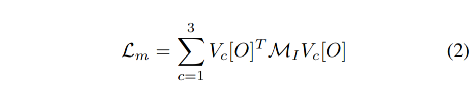

그라디언트 기반 solver에서 이 용어를 사용하려면 파생 w.r.t를 계산해야 한다.

출력 이미지. MI는 대칭 행렬이기 때문에 우리는 다음을 유추할 수 있다.

&nbsp;

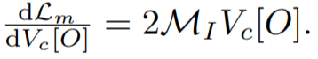

&nbsp;

### Augmented style loss with semantic segmentation

**(Eq. 1c)의 문제는 Gram matrix가 전체 이미지에 대해 계산된다는 점이다.**

Gram matrix는 구성 벡터를 등고선까지 결정하기 때문에 [18], 신경 반응의 정확한 분포를 암시 적으로 부호화하기 때문에 segmantic context의 변형에 따른 적응 능력이 제한되므로 `spills over`가 발생할 수 있다.

입력 및 참조 이미지에서의 흔한 레이블들(하늘, 건물, 물 등) 에 대한 `image segmentation mask`를 생성하기 위해 Neural Doodle [1] 및 [semantic segmentation 방법](https://arxiv.org/pdf/1606.00915.pdf)과 비슷한 방법으로 이 문제를 해결한다.

위에서 만든 `mask`를 입력 이미지에 새로운 채널로 추가한다. segmentation 채널을 연결하고 아래의 style lose를 업데이트 함으로써 `Neural Style algorithm`을 보완한다.

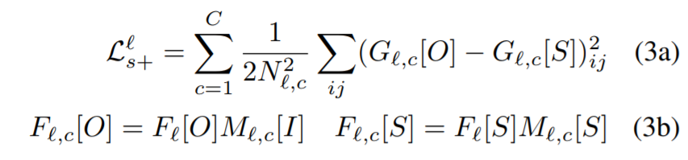

`C` : `semantic segmentation mask` 의 채널 수

M ', c [·]는 segmentation의 채널 c

mask in layer '이고, G`, c [·]는 대응하는 그램 행렬이다

~ F`, c [·]. 피쳐를 맞추기 위해 마스크를 다운 샘플링한다.
길쌈 신경의 각 계층에서 공간 크기 매핑
네트워크. 마스크를 다운샘플링 함으로써 CNN의 각 레이어의 feature map spatial size 를 맞춘다.

입력 이미지를 레이블할 때 참조 이미지의 레이블 중에서 선택하도록 하여, 매칭되지 않는 입력 레이블이 없도록 한다.

이로 인해 의미가 정확하지 않은 레이블을 가질 수는 있지만 일반적으로 문맥 상으로는 동일하다. '호수'와 '바다'처럼 말이다.

또한 픽셀 단위로 segmentation 할 필요가 없다는 것을 알아냈다. output은 정규화에 의해 제약되기 때문이다.

&nbsp;

### Out approach

우리는 3 가지 구성 요소를 모두 결합하여 `photorealistic style transfer objective`를 공식화하였다.

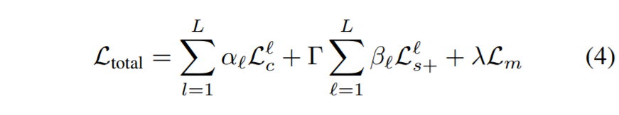

> `L` : Convolutional layers의 개수     
`l` : 몇 번째 Convolutional layer 인지  
`Γ` : 스타일 손실을 제어하는 ​​가중치  
`α와 β` : 레이어 기본 설정을 구성하는 가중치  
`λ` : photorealism regularization을 제어하는 ​​가중치  
`Lc`는 content loss (Eq. 1b)  
`Ls +` : augmented style loss (Eq. 3a)  
`Lm` : photorealism regularization (Eq. 2)  

&nbsp;
&nbsp;

## 3. Implementation Details

**이 절에서는 우리의 방법에 대한 구현 세부 사항을 설명하도록 하겠다.**

우리는 사전에 추출 된 [VGG-19](https://arxiv.org/pdf/1409.1556.pdf) 을 특징 추출기로 사용했다.

**content** 를 표현하기 위해 `conv4_2` 를 선택했다.  
(이 계층에서는 α = 1이고 다른 모든 계층에서는 α` = 0)

**style** 을 표현하기 위해 `conv1_1`, `conv2_1`, `conv3_1`, `conv4_1`, `conv5_1` 를 사용한다.  
(이들 계층에서는 β` = 다른 모든 레이어의 경우 0)

parameter는 `Γ = 10^2`, `λ = 10^4` 를 사용했다.

λ가 어떠한 영향을 주는지는 `그림 3`에 나와 있다.

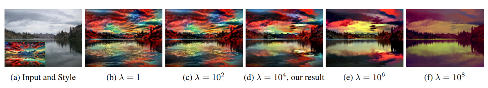

>`그림 3` : (a)의 왼쪽아래 사진(참조 이미지) 의 극적인 모습을 (a)의 일반적인 평면 샷으로 옮기는 것은 어렵다. 우리는 다른 λ 매개 변수를 갖는 방법을 사용하여 결과를 만든다.  
λ 값이 너무 작으면 왜곡을 방지 할 수 없으므로 (b, c)의 결과는 사실적이지 않은 것처럼 보여진다.  
λ 값이 너무 크면 스타일이 (e, f)에서 스타일이 변형되는 것을 막으려고 하기 때문에 변형이 덜 된 것처럼 보인다.  
우리는 λ = 10^4 일 때 가장 좋은 결과가 나오는 것을 발견했으며, 본 논문에서의 결과이미지들은 이를 적용시킨 것들이다.

&nbsp;

우리는 Levin et al.의 원래 작성자 인 Matlab 구현을 사용한다. [9] Matting Laplacian 행렬을 계산하고 `Neural Style Algorithm`의 공개적으로 사용 가능한 **Torch** 구현 [7]을 수정하였다.

photorealism regularization term의 파생물은 gradient-based optimization을 위해 CUDA에서 구현된다.

우리는 랜덤 노이즈로 초기화 된 증가 된 스타일 손실 (Eq. 3a)을 갖는 `Neural Style Algorithm` (Eq. 1a)의 출력을 사용하여 최적화를 초기화시킨다.

이 2 단계 최적화는 방정식 4를 직접적으로 해결하는 것보다 효과적이다. 왜냐하면 `photorealism regularization`으로 인해서 로컬 색상 변형에 제한이 없기 때문이다.

&nbsp;

우리는 `DilatedNet` [3]을 이용하여 입력 이미지와 참조 이미지를 모두 분할시켜보았다.

이는 150개나 되는 카테고리를 만들었다.

**분류를 세밀하게 하는 것이 오히려 알고리즘을 불안정하게 한다는 것을 알게 되었다.**

호수, 강, 바다, 물 과 같은 유사한 클래스들을 병합하니까 더 좋은 결과가 나왔다.

병합된 레이블은 보충 자료에 자세히 나와있다.

&nbsp;

우리의 코드는 https://github.com/luanfujun/deep-photo-styletransfer 에서 볼 수 있다.

&nbsp;
&nbsp;

## 4. Results and Comparison

우리의 방법을 검증하기 위해서 2가지 설문조사를 하였다.

설문조사 결과를 보기 전에, 이전의 연구들과 Ours를 먼저 비교해보자.

&nbsp;

### 왜곡

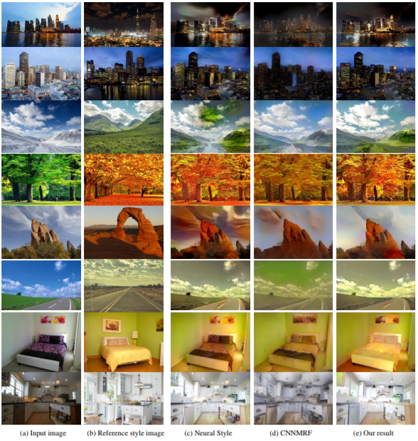

> 그림 4 : `Ours` vs `Neural Style (Gatys et al.)` vs  `CNNMRF (Li et al.)`    
`Neural Style`은 스타일 전송을 위한 segmantic context를 완전히 무시한다.   
`CNNMRF`는 nearest neighbor search를 사용하기 때문에 참조 이미지의 텍스처 대부분을 무시하는 경향이 있다.  
`우리의 방법(Ours)`은 왜곡이 없고 텍스처를 의미적으로 일치시킨다. (`Neural Style`과 `CNNMRF` 모두 왜곡이 심하다.)

&nbsp;

`그림 4`에서 두 기법 모두 **왜곡** 이 있다.

`Neural Style`은 `spills over`까지 존재한다. (`CNNMRF`에도 있꾸만..)  

위에서 설명한 것처럼 `CNNMRF`는 스타일을 부분적으로만 변형하기 때문에 중요한 부분을 무시할 수 있다.

이에 비해 우리꺼는 이러한 왜곡이 없다.

사진으로 봐도 우리 것이 더 좋아보임!

&nbsp;

### 색상

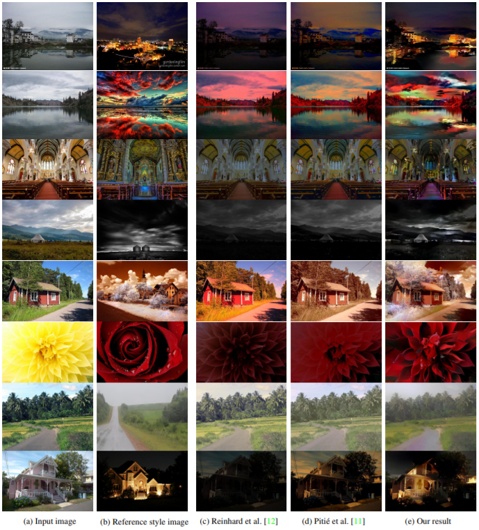

> 그림 5 : 우리의 방법 vs Reinhard et al. vs Pitié  
3가지 방법 모두 왜곡은 없다.  
하지만 ours는 **공간 변화에 따른 색상 변화** 를 두 기법보다 잘 나타낸다.

`그림 5`에서 `우리의 방법`과 이미지를 왜곡시키지 않는 `global style transfer methods (c,d)`를 비교한다.

두 기법 모두 **전체적으로 색상을 매핑** 하여 입력 이미지와 참조 이미지 사이의 색상 통계를 일치시킨다.

**부분적인 색상 변환에는 한계가 있다.** (마치 인스타 필터처럼)

`ours`는 보다 세밀한 색상 변경이 가능하다.

&nbsp;

### Time Hallucination (시간 변환)

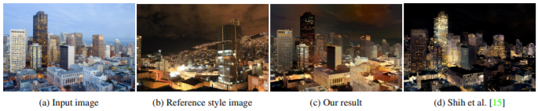

> 그림 6 : `Ours` vs `Shih et al.`  
둘 다 시각적으로 만족스러운 결과를 생성한다.  
그러나 우리 알고리즘은 단 한장의 참조 이미지만으로도 변환이 가능하다.

`그림 6`에서 우리는 `Ours`를 `Shih et al.`와 비교한다.

`Shih et al`는 `타임랩스 비디오`에서 관찰 된 색상 변화를 유추하는 기술인 반면, `Ours`는 참조 이미지의 스타일을 직접 재현하기 때문에 결과가 다르다.

Q. 두 결과 모두 시각적으로 만족스러운데 어느 것이 더 유용하다고 생각합니까?

A. 우리꺼!! 왜냐고??

1. `Shih et al.`은 변환하기 위해서 전체 시간 경과 비디오가 필요하지만, `ours`는 참조 이미지 한개만으로도 가능하다.  

2. `ours`는 시간 변환 이외의 다른 시나리오도 처리 할 수 있다.

&nbsp;

### 변환 실패한 사례들

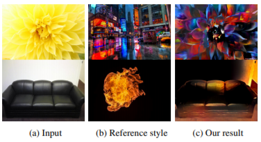

> 그림 8 : 극단적인 불일치로 인한 실패 사례

의미적으로 전혀 맞지 않는 참조 이미지를 넣으면 위의 결과처럼 개떡같이(?) 나온다.

`Manual segmentation(수동 분할)`을 사용하면 이를 수정할 수 있다.

&nbsp;

### Manual segmentation (수동 분할)

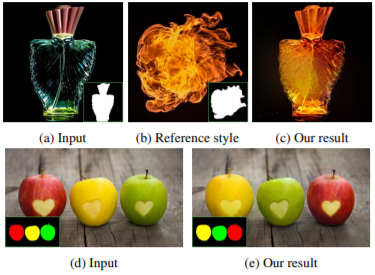

> 그림 7 : **`Manual segmentation`** 향수병(a)과 불(b)을 합쳐서 (c)를 만드는 것이 가능하다.
또, 사과들의(d, e) 질감을 변환시키는 것도 가능하다.

`그림 7`에서는 `segmantic mask`를 제공함으로써 사용자가 전송 결과를 제어 할 수있는 방법을 보여준다. 이는 예술적으로 응용할 수 있다.

또한, 향수병과 불은 서로 의미가 맞지 않아서 `semantic labeling` 이 불가능하지만 **`Manual segmentation`** 을 사용하면 처리가 가능하다.

&nbsp;

### 그밖에...

|      | 보충자료 에서 제공되는  것들 |
| :------------- | :------------- |
| 1      | `Ours` vs `Wu et al.`  |
| 2  | `semantic segmentation` 또는 `photorealism regularization` 만을 적용시킨 것  |
| 3  | 노이즈나 고해상도 입력을 처리하기 위한 솔루션  |

우리의 결과는 `NVIDIA Titan X GPU (two-stage optimization)` 에서 3 ~ 5분 내에 생성되었다.

&nbsp;

### 설문조사

우리의 연구를 검증하기 위해 두 가지 설문조사를 실시했다.

&nbsp;

#### 1. 사실적인가 ?

먼저, 평가대상의 사진들은 각각 다음 4가지 방법 중에서 1가지 방법으로 만들어졌다.

( `Ours`, `Neural Style`, `CNNMRF`, `Histogram transfer` )

사용자들에게 사진을 주고, 사지선다형으로 체크하도록 했다.

(매우 비사실적, 조금 비사실적, 조금 사실적, 매우 사실적)

우리는 총 32 개의 질문에 대해 4 가지 알고리즘 각각에 8 가지 장면을 사용했다.???????

질문 당 평균 40 건의 답변을 수집했다.

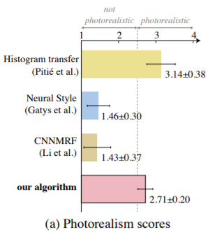

> Photorealism 결과 점수

위의 그림에서 알 수 있듯이 `CNNMRF`와 `Neural Style`은 사실적이지 않다는 답변이 많았으며, 이는 이러한 기법들이 그림처럼 보이게하는 왜곡을 만든다는 것을 알 수 있다.

또한, `Ours`는 `Histogram transfer`보다 낮긴하지만 그래도 `photorealistic`의 결과를 생성한다는 것을 보여준다.

이 결과에 힘입어 스타일을 잘 반영하는지를 평가하는 설문조사를 진행하였다.

&nbsp;

#### 2. 스타일을 잘 반영하는가?

우리는 글로벌 메소드가 변형없는 결과를 일관되게 생성했지만 스타일을 반영하는 정도가 다양하다는 사실을 발견했다.

두 번째 설문조사 대상 알고리즘은 `Histogram transfer`, `Statistics transfer`, `Photoshop Match Color`와 같은 global methods 이다.

사용자에게 총 5개의 이미지를 제공한다.

(`참조 이미지`, `Ours`, `Histogram transfer`, `Statistics transfer`, `Photoshop Match Color`)

참조 이미지와 스타일이 가장 비슷하다고 생각되는 이미지를 선택하도록 했다.

편견을 가지지 않도록 할때마다 사진 순서를 무작위로 정렬하였으며, 사용자가 출력 이미지에 집중할 수 있도록 입력 이미지는 제공하지 않았다.

20번의 비교를 실시하여 평균적으로 질문 당 35건의 답변을 받았다.

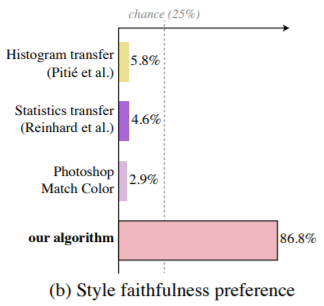

`그림(b)`는 우리 알고리즘이 스타일을 가장 잘 반영하였음을 나타낸다.

사용자가 평가했던 웹 사이트의 링크는 보충자료에서 확인할 수 있다.

&nbsp;
&nbsp;

## 5. Conclusions

우리는 참조 이미지의 스타일을 잘 적용시키는 딥러닝 방법을 소개한다.

우리는 `Matting Laplacian`을 사용하여 입력에서 출력으로의 변환이 색상 공간의 로컬 affine이되도록 제한한다.

`semantic segmentation` 은 다양한 경우에서도 시간, 날씨, 계절 및 예술적으로 수정하는 등의 작업을 사실적으로 변형시킨다.

&nbsp;
&nbsp;

## Acknowledgments

Leon Gatys, Frédo Durand, Aaron Hertzmann, 그리고 열띤 토론을 펼친 분들에게도 감사하다.

Fuzhang Wu에게 감사하다??? (왜 감사하는지 모르겠다...)

이 연구는 Google Faculty Research Award, NSF Awards IIS 1617861 및 1513967에서 지원받았다.

&nbsp;
&nbsp;

## References

(Link로 대체)
